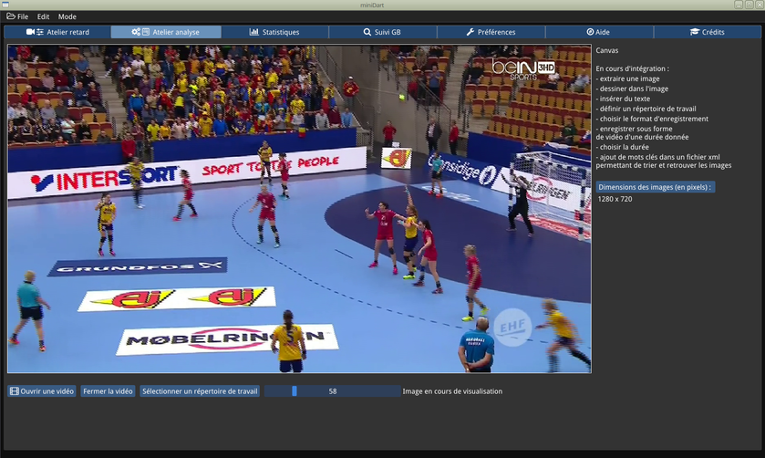

**VERSION EN FRANCAIS** (english version follows)

:::::::::::::::::::::::::::::::::::::::::::::::::::::::::::::::::::::::::::::::::::::::::::::::::::::::::::::::::::::::::::::::::::::::::::::::::::::::::::::::::::::::::::::::::::::::::::::::::::::::::::::::::::::::::::::::::::::::::::::::::::::

**AVANT TOUTE CHOSE : sous Windows, vous DEVEZ installer les pilotes 3D de votre carte graphique.**

**SINON, cela ne fonctionnera PAS.** (miniDart ne se lancera même pas ...)

**Exemple : ceux fournis par Intel si votre machine possède un chipset Intel intégré, etc. En particulier les drivers OPENGL.**

Remarque : il se peut, dans votre cas, que les pilotes nécessaires soient des anciens pilotes (Win7+), mais ils fonctionnent très bien.

:::::::::::::::::::::::::::::::::::::::::::::::::::::::::::::::::::::::::::::::::::::::::::::::::::::::::::::::::::::::::::::::::::::::::::::::::::::::::::::::::::::::::::::::::::::::::::::::::::::::::::::::::::::::::::::::::::::::::::::::::::::

# miniDart (version actuelle au téléchargement : 0.9.4 (Windows7+ avec multi-viewports inclus) 0.9.3 (binaire pour LinuxMint)** )
Logiciel d'analyse vidéo pour coachs de sports collectifs (handball, mais autre sport collectif possible)

**Pour le téléchargement, cliquer ici : https://framagit.org/ericb/miniDart/blob/master/testing_version/miniDart_0.9.4_test.exe**

Pour télécharger une autre version : https://framagit.org/ericb/miniDart/tree/master/testing_version

Ceci est une version de démonstration du logiciel **miniDart**. Elle n'est pas complète, et comporte probablement quelques bugs. Une partie des fonctionnalités est encore manquante, et devrait être implémentée progressivement.

**IMPORTANT : Cadre de ce projet**

**Un projet de développement handball, est en cours. Le logiciel miniDart sera une des ressources utilisées pour son financement. Le but est de financer un tournoi international de handball pour une équipe féminine jeunes (-13)**

**Ainsi, le logiciel miniDart, lorsqu'il sera complet, sera dans un premier temps vendu (dans les ~100 euros / club). Quand suffisamment d'argent aura été récupéré, les sources du logiciel seront mises sous licence LGPL.**

Deux versions sont disponibles au téléchargement. **L'une pour Windows 7 (64 bits)** ou plus récent, l'autre pour **Linux Intel (64 bits)**. Pour la version Linux, des instructions sont données dans le répertoire contenant les archives.

La version en téléchargement a besoin de Windows 7 ou plus + pour fonctionner, et vous est fournie avec un installeur. La désinstallation a aussi été testée, et supprime toute trace du logiciel. **Si vous l'installez**, notez que vous utilisez ce logiciel à vos risques et périls, et n'oubliez pas qu'il est impératif de faire des sauvegardes de vos document AVANT de l'utiliser.

Pré-requis

Si la lumière ambiante est suffisante, on peut visualiser et enregistrer les images issues d'une webcam (préférer les références conseillées + bas) au rythme de 30 images par seconde en 1270 x 720 (aka 720p). L'enregistrement se fait pour l'instant au format .avi avec l'encodage en divx. Le son n'est pour l'instant pas géré. La version Linux fonctionne de façon similaire, mais en 24 images par seconde.

Matériel
Processeurs / RAM conseillés:
* i5 + 4 Go minimum
* i7 + 8 Go confortable :+1: 

L'installation demande ~ 35 Mo de place sur le disque + de la place pour les fichiers vidéos créés.

Webcam vivement conseillées et longuement testées :
- **Logitech C920** meilleur rapport qualité prix :+1:  ; USB2.0 ou + , 30 images par seconde, mais demande une bonne lumière)
- Logitech C922 USB 2.0 ou + , demande une bonne lumière
- **Logitech Brio 4K** plus chère que la C920, mais la meilleure actuellement :+1: permet d'enregistrer à 30 ou 60 images par seconde 720p (jusqu'à 4K possibles avec ffmpeg), mais **demande une connexion USB 3.0 mini** + une lumière suffisante)
- Microsoft Lifecam C3000 : demande quelquefois de relancer une fois miniDart, (demande une bonne lumière)

N.B. : si vous n'avez pas de webcam, un téléphone portable avec l'application Droidcam (ou IP Webcam) peut servir de source d'images.

(voir : [Utiliser son téléphone portable comme une webcam avec minidart](https://framagit.org/ericb/miniDart/wikis/utiliser-son-t%C3%A9l%C3%A9phone-portable-comme-une-webcam-avec-miniDart) )

Pour une bonne définition, notez bien qu'il faudra probablement installer une version payante de l'application Droidcam ou IP Webcam (par exemple).

**Système d'exploitation : testé sur Windows 7 et Win 10  64 bits** (une version de test en 32 bits est disponible, mais sur demande uniquement).

Important : si l'application crashe sans explication, c'est que vous avez simplement oublié d'installer les pilotes pour votre carte graphique.
J'ai corrigé un grand nombre de fois ce problème sous Windows pour tous ceux qui n'arrivaient à rien du tout ;-)

**Ajouts dans la 0.9.5 (à venir, Windows surtout)**

**Atelier analyse** :
- [x] **Incrustation vidéo** : on peut ajouter à l'image en cours de lecture ou d'enregistrement, une incrustation contenant du texte (à entrer soi-même). 
- [x] Le positionnement de l'incrustation, la couleur du texte, du fond du cadre, ou encore la taille de la police de caractère (.ttf) sont modifiables.
- [x] Lecture de vidéos au format .mkv
- [x] détection et affichage de toutes lesr sources sonores pouvant être enregistrées
- [x] sélection de la source audio à associer à l'image en cours de visionnage
- [x] Nombreuses correction de bugs

En cours de test ou à venir :

- [ ] affichage de l'incrustation vidéo sur plusieurs lignes
- [ ] affichage d'une incrustation vidéo "customisée" (image transparente par exemple)
- [x] (fonctionne, pas encore implémenté) remplacement de OpenCV pour la création de vidéos par direct_cv_encode (création de mp4 de qualité avec ffmpeg)
- [ ] capture audio : (fonctionnel mais pas intégré encore)
- [ ] (à venir) création de vidéos **incluant le  son** et image avec multiplexage audio et son (ffmpeg) + openal (Linux) ou direct show (Windows)
- [ ] (Windows seulement) possibilité d'affcher la boîte de dialogue pour régler tous les paramètres de la source sonore.
- [ ] Choix de la police de caractère pour l'incrustation
- [ ] Possibilité de créer plusieurs incrustations simultanées

**Ce qui est actuellement fonctionnel** (dans la **version 0.9.4**) :

- [x] **affichage retardé** (réglable jusqu'à 40s, mais pourra être augmenté en cas de besoin spécifique (à la demande). Testé OK jusqu'à 100s de retard, mais il faut beaucoup de RAM dans ce cas)
- [x] permet le **séquençage vidéo** (le son n'est pas géré pour l'instant)
- [x] **enregistrement** avec ou sans retard des images issues d'une ou plusieurs webcams USB ou Webcam IP (une seule peut être enregistrée à la fois), ou d'une vidéo en cours de lecture
- [x] **chronomètre** : on peut ajouter le chronomètre, et incruster le temps dans les vidéos enregistrées
- [x] affichage du temps d'activité (cumul si chronomètre activé) et/ou le temps total (depuis le premier appui sur start)
- [x] changement de webcam en live (il est toutefois conseillé de démarrer miniDart AVEC la webcam branchée)
- [x] ouverture d'une vidéo Windows et Linux (le son devrait fonctionner. Crashes possibles : attention !). Arrêt et reprise de la vidéo (barre espace).
- [x] recherche, avance rapide, retour rapide, retour au début, recherche à un temps donné avec curseur(CTRL+clic pour choisir le temps)
- [x] thème modifiable (onglet préférences ou menu)
- [x] toute l'interface utilisateur est modifiable en cours de fonctionnement, mais n'est pas mémorisée pour le prochain démarrage)
- [x] le mode statistiques est en cours d'implémentation, et toute suggestion d'amélioration est la bienvenue
- [x] ouvrir un fichier de type vidéo (sera utilisé pour le mode image par image et l'analyse+séquençage avec ajout de tags)
- [x] **mode image par image** (déjà disponible ici : https://github.com/ebachard/cv_slideshow fonctionne en mode "drag and drop") ;
- [x] selon l'installation, il est possible de régler directement les paramètres de la webcam, comme la luminance, etc  (onglet "paramètres")
- [x] **réglage du focus** : passage en mode manuel ou automatique, **réglage en mode "microscope"**
- [x] **Exposition** : réglage manuel possible. Problème connu (Linux seulement) : on ne peut pas repasser en mode automatique sans redémarrer miniDart pour l'instant
- [x] **Rotation des images**, visionnage et enregistrement. Par exemple si images venant d'un smartphone.Valeurs possibles : 90° (sens horaire ou sens trigo),
- [x] **flip horizontal** visionnage et enregistrement (pour masquer une publicité, etc) ou **flip vertical** ( 180°, certaines webcams ont un problème).
- [x] **utilisation en webcam d'un smartphone fonctionnant sous Android** . Demande à installer Droidcam sur votre smartphone. Visionnage et enregistrement, avec ou sans rotation d'image de 90° possible (prise de vue en position horizontale conseillée toutefois).
- [x] **spot mode** : encerclez une zone importante dans ce qui est actuellement affiché (enregistrement à venir)
- [x] Nouvelle entrée de menu, permettant de séctionner la source des images.

**Atelier analyse** :
- [x] ouverture d'un répertoire contenant une vidéo
- [x] choix du répertoire d'enregistrement par défaut des vidéos (à tester de façon plus approfondie)
- [x] **analyse image par image** : on ouvre une vidéo de courte durée (30 s max conseillé) et on peut piloter le défilement avec les flèches G/D 
- [x] modification de la taille de l'image en mode slideshow
- [x] **ralenti (nouvel algorithme) ajustable en images par seconde**. Fonctionne de 5 images par seconde à ~60 images par seconde (accéléré si fps réel < 60)
- [ ] extraction et annotation d'une image (à venir, puis enregistrement sur une durée donnée (format .avi, pas de son)

**Atelier Suivi de l'équipe** :
- [x] Suivi par actions : But, Attaque placée, etc
- [x] Mesure performance de l'équipe : + - en fonction des actions pour chaque jouer, et affichés de façon globale pour 'léquipe'

À venir : annotations + enregistrement de l'image sous forme d'une vidéo de durée donnée.

**Atelier suivi GB** :
- [x] saisie de tous les types de tirs (y compris 7m)
- [x] affichage des statistiques ( % d'arrêt, % de réussite, secteurs favorables, défavorables, suivi des tirs par joueur)
- [x] couleur du tir en fonction du résultat (but, arrêt GB, poteau, tir hors cadre)
- [x] tracé des impacts de tirs par glisser-déposer à la souris
- [x] possibilité d'ajouter une flèche, et de régler les dimensions
- [ ] ajout du numéro du tireur (bug connu, ne fonctionne pas encore correctement)
- [x] saisie nom de la GB / du GB suivi
- [x] saisie niveau du championnat / mode entraînement ou match / en mode match, pour la N2F, choix du club
- [x] saisie de la mi-temps en cours
- [x] mode suivi statistique type feuille de match (GB ou joueurs d'une équipe) ;
- [x] choix du type de tir (pour un 7m, il faut activer le bouton "7m" AVANT de tracer le tir, sinon le tir sera pris pour un tir normal)
- [x] icônes pour le chronomètre, les sources (webcam 1 ou 2)

**En cours de développement** (mais déjà partiellement fonctionnel) :
- **multi écrans** ( on peut détacher l'onglet avec les images sur un second écran, tout en continuant le suivi GB et le remettre après !)
- **onglets déplaçables/détachables activables/désactivables : on pourra "sortir" l'onglet contenant la vidéo, et l'afficher sur un autre écran**
- **Traduction de l'interface utilisateur en anglais : 40% réalisé à ce jour** (actually)

Atelier retard :

- [x] ajout d'une source vidéo de type fichier vidéo
- [x] lecture seulement vidéo + son synchrone (quelques problèmes à résoudre encore)
- [x] séquençage d'une vidéo (traitement des images seulement)
- [x] ajout d'une source réseau, type webcam IP (utilise ffmpeg)
- [x] recherche, avance rapide, retour rapide, positionnement à un temps donné
- [ ] calibration de la webcam (distorsion, calcul approché des coeffficients pour les aberrations de sphéricité) // en tests
- [ ] correction distorsion en temps réel (pixels shaders ou OpenCV) // en tests
- [ ] conversion YUV / RGB (OpenGL + pixel shaders) (en coursd'implémentation) 
- [ ] ajout d'annotations dans la vidéo
- [ ] tracking en temps réel (en tests)
- [ ] repères visuels en temps réel

Atelier GB :
- [ ] annotations
- [ ] saisie des conditions du tir
- [ ] dessin des statistiques en temps réel

À venir :
- [ ] mode ralenti (slow-motion) // fonctionne déjà, mais demande une conversion d'OpenCV+highgui vers OpenGL
- [ ] choix vitesse de défilement (% de vitesse 0 à 200% par exemple)
- [ ] Factorisation du code, avec réécriture de nouvelles classes : Engine, Application, CaptureDev, RecorderDev, Canvas, ShootsManager

Informations techniques:

Ce logiciel est écrit sous Linux, et cross-compilé pour fonctionner sous Windows 64 bits. Les APIs utilisées sont:
* **SDL2 2.0.9** ( http://libsdl.org/) pour le fenêtrage et la remarquable portabilité Linux -> Windows ; (version 2.0.9 pour Windows, 2.0.8 Linux)
* **OpenGL** (https://www.khronos.org/opengl/) pour le rendu ;
* **Dear ImGui** (https://github.com/ocornut/imgui) pour l'interface utilisateur et les performances graphiques (merci à **Omar Cornut** pour cette UI géniale) ;
* **OpenCV 3.4.0** (https://opencv.org/) : gestion des webcams, traitement des frames, annotations (chronomètre, enregistrement) ;
* **mdPlayer** (https://framagit.org/ericb/mdplayer ): pour le son dans les vidéos (lecture ET -bientôt- enregistrement aussi pour le son).
* **DirectShow** et **DirectX** ( sous Windows) , v4l2 + gstreamer (sous Linux) : acquisition vidéo ;
* **FFMPEG (version 4.0.3, Windows et Linux)** (http://ffmpeg.org/) ouverture, analyse, export de fichiers vidéos (divx, avi etc) ;
* **mingw-w64** (https://mingw-w64.org/doku.php) cross-compilation de la version Windows ;
* **InnoSetup** (http://www.jrsoftware.org/) pour le packaging Windows ;
* **wine64** (https://www.winehq.org/) pour les tests de la version Windows sous Linux;
* **Native File Dialog** (https://github.com/mlabbe/nativefiledialog), ouverture d'un fichier, sauvegarde, écrit par **Michael Labbe**.
* **Font AweSome** (https://github.com/juliettef/IconFontCppHeaders ) pour les fontes-icones créées par **Juliette Foucaut**.
* (en cours d'implémentation) **OpenAL**  (https://www.openal.org LGPL), écrit par **kcat**. Utile pour capturer le signal issu d'une source audio, et l'adapter à ffmpeg.
* (en cours d'implémentation, pas certain de l'utiliser encore) **opencv-ffmpeg** (https://github.com/2vin/opencv-ffmpeg MIT License). Écrit par **2vin**. transforme une suite de frames de type  cv::Mat en une vidéo au format .mp4 (fonctionne super bien !)
* (en cours d'implémentation, très intéressant, à confirmer) **mediaMuxer**  (https://github.com/jerett/mediaMuxer MIT License), written by **WenJie JIANG**, extremely helpfull to mux audio and video for recording the final video.

* (prochainement) **TinyXML2** (https://github.com/leethomason/tinyxml2) pour les tags xml lors de l'analyse et le classement d'une vidéo.
* (prochainement) **delay** (https://github.com/rom1v/delay), écrit par **Romain Vimont**, qui permet de retarder son + image d'une durée ajustable, mais toujours **synchronisés**. 

**Auteur du logiciel miniDart : Eric Bachard © 2016-2019**

**ENGLISH VERSION**

:::::::::::::::::::::::::::::::::::::::::::::::::::::::::::::::::::::::::::::::::::::::::::::::::::::::::::::::::::::::::::::::::::::::::::::::::::::::::::::::::::::::::::::::::::::::::::::::::::::::::::::::::::::::::::::::::::::::::::::::::::::::::::::::::::::

**FIRST OVER ALL : under Windows, you MUST install the 3D drivers of your graphic card, more precisely you need OpenGL drivers.**

**ELSE, IT WON'T WORK.** (miniDart would not even launch ...)

**For example, the one provided by Intel, if your machine embeds an Intel integrated chipset, and so on ... (please adadpt to your own case)**

:::::::::::::::::::::::::::::::::::::::::::::::::::::::::::::::::::::::::::::::::::::::::::::::::::::::::::::::::::::::::::::::::::::::::::::::::::::::::::::::::::::::::::::::::::::::::::::::::::::::::::::::::::::::::::::::::::::::::::::::::::::::::::::::::::::

#miniDart (current version: 0.9.4 (Windows7+ including multi-viewports) and 0.9.3 (binary for LinuxMint)** )
Video analysis software for team sports coaches (handball, but not only)

This is a demo version of the **miniDart** software. It is not complete, and probably has some bugs. Some of the features are still missing, and should be implemented progressively.

**IMPORTANT: Framework for this project**

**A handball development project is underway. The miniDart software will be one of the resources used for its financing. The goal is to fund an international handball tournament for a young women's team (-13)**

**Thus, the software miniDart, when complete, will be sold first. When enough money has been recovered, the sources of the software will be licensed under the LGPL.**

Two versions are available for download. One for **Windows 7 (64 bits) or later**, the other for **Linux Intel (64 bits)** . For the Linux version, instructions are given in the directory containing the archives.

The download version needs Windows 7 or more + to work, and comes with an installer. The uninstallation has also been tested, and removes all traces of the software. If you install it , note that you use this software at your own risk, and remember that it is imperative to make backups of your documents BEFORE using it.

**For download, click here: https://framagit.org/ericb/miniDart/tree/master/testing_version**

Prerequisites

If the ambient light is sufficient, we can view and record images from a webcam (prefer the recommended models below) at the rate of 30 frames per second in 1270 x 720 (aka 720p). The recording is currently in .avi format with the encoding divx. The sound is not currently managed. The Linux version works similarly, but in 24 frames per second.

Hardware Processors / RAM advised:

* i5 + 4 GB minimum
* i7 + 8GB comfortable :+1:

The installation requires ~ 35 MB of disk space + space for the created video files.

Webcam highly recommended and extensively tested:

- **Logitech C920** the better quality/price ratio :+1: Needs USB 2.0 or + 30 frames per second, but requires good light)
- Logitech C922 (needs a good light)
- **Logitech Brio 4K** more expensive than the C920 but currently the best webcam :+1: (60 or 30 frames per second 720p, but **needs USB 3.0 to work** (+ needs a good light))
- Microsoft Lifecam C3000: sometimes asks to restart once miniDart, (needs a good light) 

Operating system: tested on Windows 7 and Win 10 64-bit (a 32 bits version forwin7+ is available, but on demand only).

Important : just in case the application crashes at launch, without any information, it's probably because you forgot
to install the right graphic card drivers. Seen a lot of times with people stuck at launch with the issue ;-)

**Recent changes in the 0.9.5 version (to come soon, Windows only)**

**Ajouts dans la 0.9.5 (à venir, Windows surtout)**

**Atelier analyse** :
- [x] **Incrustation vidéo** : on peut ajouter à l'image en cours de lecture ou d'enregistrement, une incrustation contenant du texte (à entrer soi-même). 
- [x] Le positionnement de l'incrustation, la couleur du texte, du fond du cadre, ou encore la taille de la police de caractère (.ttf) sont modifiables.
- [x] Lecture de vidéos au format .mkv
- [x] détection et affichage de toutes lesr sources sonores pouvant être enregistrées
- [x] sélection de la source audio à associer à l'image en cours de visionnage
- [x] Nombreuses correction de bugs

**Analysis workshop** :
- [x] **Video Incrustation** : one can insert video incrustation containing a simple text (fully customizable) in the current image (reading or recording).
- [x]The colors of the text, its background, the (.ttf) font size, the incrustation position and so on are fully customizable.
- [x] mkv can now be open (Linux and Windows).
- [x] detection and display of all available and recordable audio sources (e.g. webcam)
- [x] one can select the recordable audio source to associate to the frames currently displayed.
- [x] Various bugfixes.

Currently in test or work in progress :

- [ ] display the incrustation using several lines (i.e. a vector of). Currente status : one line only
- [ ] display a customized video incrustation (e.g. complex box + transparent background)
- [x] (works, not yet implemented) replace OpenCV using direct_cv_encode (fork of opencv-ffmpeg), with creation of a high quality video using fmpeg.
- [ ] capture audio : (fonctionnel mais pas intégré encore)
- [ ] (to come) create videso including **audio**(à venir) + multiplexed with the currently displayed frames (media Muxer + ffmpeg) + openal (Linux) or direct show (Windows)
- [ ] (Windows seulement) possibilité d'affcher la boîte de dialogue pour régler tous les paramètres de la source sonore.
- [ ] Choose the font
- [ ] Create several (a vector of) incrustations simulaneously

**What is currently functional in the 0.9.4** (and will be improved progressively):

- [x] **Pan, Tilt and Zoom** : hardware zoom, depending on your webcam. The zoomed images can be directly recorded, delayed or not. Example : Logitech Brio allows until x 5.0 hardware zoom + pan and tilt in the zoomed area. Logitech C920 and C922 : zoom x 2.0 only + pan and tilt
- [x]    Lense (from x1.0 to x3.0 and up to x4.0 for Linux version) of part of the image (but the zoomed area cannot be recorded)
- [x]    delayed display (adjustable up to 40s, but can be increased, tested OK up to 100s delay, but you need a lot of RAM in this case)
- [x]    allows video sequencing (the sound is not managed at this time)
- [x]    recording with or without delay images from one or more webcams -including IP webcam (only one can be recorded at a time), or from the currently displayed video 
- [x]    stopwatch: you can add the stopwatch, and embed the time in recorded videos
- [x]    display of the activity time (cumulative if stopwatch activated) and / or the total time (since the first press start)
- [x]    live webcam change (however it is advisable to start miniDart WITH the webcam connected)
- [x]    editable theme (preferences tab)
- [x]    the entire user interface is editable during operation, but is not memorized for the next start)
- [x]    the statistics mode is being implemented, and any suggestion of improvement is welcome
- [x]    open a video type file (will be used for image-per-image mode and analysis + sequencing with tagging)
- [x]    seek, fast forward, fast backward, return at zero, seek at a gien time (CTRL+clic to select the time value)
- [x]    image by image mode (already available here: https://github.com/ebachard/cv_slideshow works in "drag and drop" mode); 
- [x]    **focus** : manual mode or automatic. Possible use in "Microscope" mode.
- [x]    **exposure** : manual mode or automatic. Known issue  (Linux only) : miniDart must restart to retrieve the automatic mode (WIP).
- [x]    **image rotations** : displaying or recording. For example when the images come from a smartphone, with a 90° orientation (both clockwise or counter clockwise are possible)
- [x]    **horizontal flip** (to hide publicity, or simply when needed, or **vertical flip** (180°) are possible. e.g. this can be helpfull with some buggy webcams.
- [x]    **Android smartphone as a webcam** . Install droidcam or equivalent is mandatory. Display and record, with or without 90° image rotation (horizontal watching advised though).
- [x]    **spot mode** : enlight the important area on the screen
- [x]    New menu entry, to improve the user experience

Workshop analysis :

- [x]    open a directory containing a video
- [x]    choice of default video recording directory (to be tested further)
- [x]    **image-by-image analysis**: we open a video of short duration (30s maximum recommended) and we can control the scrolling using R/L keys
- [x]    **tweakable slow motion**. Works from 5 fps (true slow motion) to  ~40 fps (accelerated). 60 fps is very approximative on Linux.

Upcoming: annotations + recording of the image as a video of a given duration.

GK follow-up workshop :

- [x]    capture of all types of shots (including 7m)
- [x]    display of statistics (% off,% success, favorable, unfavorable sectors, tracking shots per player)
- [x]    shot color according to the result (goal, stop GB, post, shot outside frame)
- [x]    dragging shots to the mouse
- [x]    ability to add an arrow, and adjust the dimensions
- [ ]    adding the shooter's number (known bug, does not work properly yet)
- [x]    enter name of the followed GK
- [x]    entry level championship / training mode or match / match mode, for the N2F, club choice
- [x]    current half-time
- [x]    statistical follow-up mode type sheet of match (GB or players of a team);
- [x]    choice of the type of shot (for a 7m, you have to activate the "7m" button BEFORE you draw the shot, otherwise the shot will be taken for a normal shot)
- [x]    icons for stopwatch, sources (webcam 1 or 2) 

Under development (but already partially functional):

**English localization : 40% done** (actually)

Workshop delay:

- [x] (works) use a video file as video source. Using both ffmpeg (frames+sound) or OpenCV (frames only)
- [x] (works) read only a video (frames + sound synch'ed (SDL2_ffmpeg)
- [x] (works) use an IP webcam as video source (ffmpeg) // be carefull : crashes possible ! // WIP 
- [ ] webcam calibration (distorsion, barrel or pincushion aberrations ) // WIP
- [ ] real time distorsion correction(pixels shaders or OpenCV) // WIP
- [ ] visual cues in real time 
- [x] (works) video sequencing (frames only, no sound yet)
- [ ] (work in progress) YUV to RGB conversion (ffmpeg + OpenGL + pixel shaders)
- [x] (WIP) realtime annotations in the frames 
- [ ] (WIP) realtime tracking

GK Workshop:

- [ ]    annotations
- [ ]    capture shooting conditions 

To come up :

- [ ]    slow-motion mode // works already, but requires conversion from OpenCV + highgui to OpenGL 
- [ ]    select the visualization speed (% speed from 0 to 200% forr example)

**Team follow up workshop** :
- [x] follow up by actions : Goal, placed attacks, and so on
- [x] Team performance measuring : + - depending on the played actions, and displayed globaly (Team result)

Technical informations:

This software is written on Linux, and cross-compiled to run on 64-bit Windows. The APIs used are:

* **SDL2 2.0.9** ( http://libsdl.org/ ) for windowing and remarkable portability Linux -> Windows;
* **OpenGL** ( https://www.khronos.org/opengl/ ) for rendering;
* **Dear ImGui** ( https://github.com/ocornut/imgui ) for user interface and graphics performance (thanks to **Omar Cornut** for this awesome UI);
* **OpenCV 3.4.0** ( https://opencv.org/ ): management of webcams, processing of frames, annotations (stopwatch, recording);
* **mdPlayer** (https://framagit.org/ericb/mdplayer ):for sound in videos (reading AND -soon- recording) 
* **DirectShow** and **DirectX** (on Windows), v4l2 + gstreamer (on Linux): video acquisition;
* **FFMPEG (version 4.0.3 on both Windows and Linux)** ( http://ffmpeg.org/ ) opening, analysis, export of video files (divx, avi etc);
* **mingw-w64** ( https://mingw-w64.org/doku.php ) cross-compilation of the Windows version;
* **InnoSetup** ( http://www.jrsoftware.org/ ) for Windows packaging;
* **wine64** ( https://www.winehq.org/ ) for testing the Windows version on Linux;
* **Native File Dialog** ( https://github.com/mlabbe/nativefiledialog ), open file, save, written by **Michael Labbe** .
* **Font AweSome** ( https://github.com/juliettef/IconFontCppHeaders ) for font-icons created by **Juliette Foucaut** .
* **(coming soon) **TinyXML2** ( https://github.com/leethomason/tinyxml2 ) for xml tags when analyzing and ranking a video.
* (work in progress) **delay** (https://github.com/rom1v/delay MIT License), written **Romain Vimont**, allowing to delay AND keep frames+sound in sync **easely**.. 
* (tests in progress) **OpenAL**  (https://www.openal.org LGPL), écrit par **kcat**. Usefull to catch an audio source audio, and make it usable by ffmpeg.
* (work in progress, to be confirmed) **opencv-ffmpeg** (https://github.com/2vin/opencv-ffmpeg), written by **2vin** : turn OpenCV cv::Mat into mp4 (works very well !)
* (work in progress, extremely usefull) **mediaMuxer**  (https://github.com/jerett/mediaMuxer), written by **WenJie JIANG**, extremely helpfull to mux audio and video for recording the final video.
**Author of miniDart software: Eric Bachard © 2016-2019**
